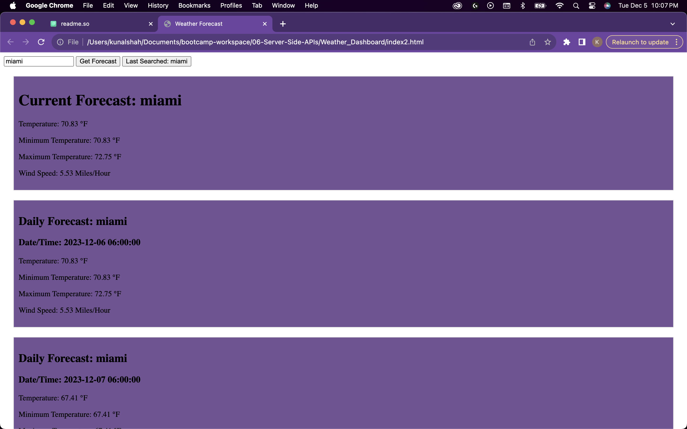

# Weather_Dashboard

Description -- This web application uses the openweathermap API in order to allow the user to search for a current and 5 day weather forecast in their desired city. This will pull accurate dynamic weather information pulled from the API 
 
Use -- Enter your desired city in the search bar, click the button and view the forecasted weather. Also, if the page is reloaded, user can click on the last searched city button and see the weather of the last searched city. 

screenshot -- 

deployed website URL: 