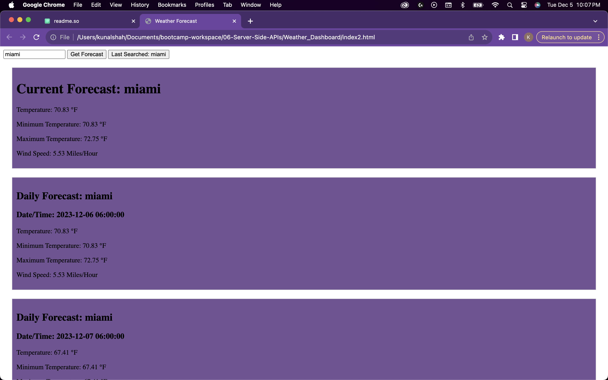

## Weather Dashboard using WeatherAPI 

[](https://opensource.org/licenses/MIT)

## Table of Contents
* [Description](#description)
* [Installation](#installation)
* [Usage](#usage)
* [Technologies](#technologies)
* [Screenshots](#screenshots)
* [License](#license)
* [Author](#author)

## Description

The application is a Weather dashboard which allows the user to search for a specific city and get the weather conditions, temperature, humidity and windspeeds. The user can also see a log of their last searched cities so they can reference back to them if needed. This web app uses OpenWeatherMap API to gather the city's weather information and display it for the user. 

The URL of the GitHub repository is https://github.com/unfazedxx/Weather_Dashboard

🚀The application has been deployed to Github Pages and the URL of the deployed application is:
https://unfazedxx.github.io/Weather_Dashboard/


## Installation

- Click the provided Github Pages link 

OR

*  To install this application please follow these directions:

    - Clone the github repository via CLI
    - Right click on the Index.html file, and choose Open with Live Server


        

## Usage

## User Story

```
AS A traveler
I WANT to see the weather outlook for multiple cities
SO THAT I can plan a trip accordingly
```

## Acceptance Criteria

```
GIVEN a weather dashboard with form inputs
WHEN I search for a city
THEN I am presented with current and future conditions for that city and that city is added to the search history
WHEN I view current weather conditions for that city
THEN I am presented with the city name, the date, an icon representation of weather conditions, the temperature, the humidity, and the wind speed
WHEN I view future weather conditions for that city
THEN I am presented with a 5-day forecast that displays the date, an icon representation of weather conditions, the temperature, the wind speed, and the humidity
WHEN I click on a city in the search history
THEN I am again presented with current and future conditions for that city
```


## Technologies
- JavaScript
- HTML 
- CSS
## Screenshots


## License

[](https://opensource.org/licenses/MIT)

This project is licensed under the terms of the MIT license.

## Author

I hope you enjoyed this coding quiz application.

If you have further questions or wish to see the other projects I have completed, please visit my Github repository here: [Kunal's Github](https://github.com/unfazedxx).

You can also reach out via email at: 
<a href="mailto:shahkun02@gmail.com">shahkun01@gmail.com</a>

Happy coding 😊
